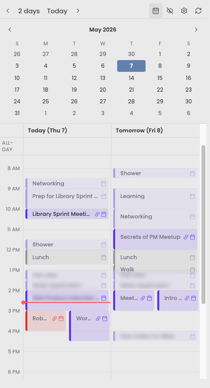

# Knox Timeline

Timeline view of your Fastmail calendar in an Obsidian sidebar leaf, with one-click meeting note creation.

## Why this exists

I really like the two day timeline view for daily planning and meeting prep, but I do most of my note-taking in Obsidian. Existing Obsidian calendar plugins lean toward month grids or to-do lists, neither of which answer "what does my day actually look like." Knox Timeline brings the timeline format into Obsidian's right sidebar, sourced from Fastmail via CalDAV, and lets me turn any event into a meeting note with one click.

## Features

- Single-day or two-day (today + tomorrow) timeline views
- All-day events shown in a strip above the timed grid
- Multi-calendar support with per-calendar enable/disable
- One-click meeting note creation from any event
- Hide noisy events (recurring blockers, declined invites) with the ability to unhide later
- Auto-refresh at midnight and on stale data
- Commands for previous/next day, jump to today, and refresh

## Install

Knox Timeline is not yet in the Community plugins directory. Install it via BRAT for now.

### Via BRAT

1. Install the [BRAT plugin](https://github.com/TfTHacker/obsidian42-brat) from the Community plugins directory.
2. In Obsidian: Settings → BRAT → **Add Beta plugin**.
3. Paste: `cwagner223355/knox-timeline`
4. Enable **Knox Timeline** in Community plugins.

### From the Community plugins directory (once accepted)

1. Open Obsidian → Settings (⌘,) → Community plugins
2. If you see "Restricted mode is on", click Turn on community plugins
3. Click Browse, search "Knox Timeline", then Install and Enable.

## Setup

1. Generate a Fastmail app password: Fastmail → Settings → Privacy & Security → **App passwords**. Give it Calendars (CalDAV) access only.
2. Open Knox Timeline settings: enter your Fastmail email and app password.
3. Click **Refresh calendar list** to discover your calendars.
4. Toggle which calendars to include in the timeline.

## Settings

| Setting | Type | Default | Description |
|---|---|---|---|
| Fastmail username | text | empty | Your full Fastmail email address. |
| Fastmail app password | secret | empty | App password with Calendars (CalDAV) access. Stored in Obsidian's SecretStorage; see security notes below. |
| First day of week | dropdown | Sunday | Sunday or Monday, controls the leftmost column in the month calendar. |
| External iCal URLs | list | empty | Read-only iCal feeds (Google Calendar secret URL, iCloud public calendar, Outlook published calendar, etc.). Each has name, URL, color, and an enabled toggle. |
| Default view | dropdown | Today and tomorrow | Single day or today + tomorrow side-by-side. |
| Enabled calendars | toggle list | all discovered | Which calendars to include in the timeline. |
| Meeting note folder | text | Meeting Notes | Vault folder where notes created from an event are saved. |
| Meeting note template | text area | built-in default | Body for new meeting notes. Placeholders: `{{title}}`, `{{date}}`, `{{start_time}}`, `{{end_time}}`, `{{video_url}}`, `{{busycal_url}}`, `{{uid}}`, `{{daily_note}}`. Keep `event_uid` so a note can be matched back to its event. |

## Commands

| Command | What it does |
|---|---|
| Open panel | Open the timeline panel in the right sidebar. |
| Refresh | Re-fetch events from Fastmail. |
| Previous day | Shift the timeline anchor back one day. |
| Next day | Shift the timeline anchor forward one day. |
| Jump to today | Reset the anchor to today. |

## Security notes

The Fastmail app password is stored in Obsidian's [SecretStorage](https://docs.obsidian.md/plugins/guides/secret-storage) on the device where you entered it. It does not sync with your vault.

Use a scoped Fastmail app password, giving it Calendars (CalDAV) access only. You can revoke it at any time from Fastmail settings.

Network traffic to `caldav.fastmail.com` is HTTPS only, so credentials are encrypted in transit.

For offline display, the most recently fetched events (titles, times, attendees) are cached in the plugin's `data.json`. Unlike the password, that file **does** sync if your vault syncs. Add the plugin folder to your sync exclusions if that is a concern.

## Known limitations

- Read-only: events cannot be created or edited from the timeline.
- Desktop only. Mobile support is not planned for v1.
- External iCal feeds are shown as-is: recurring events are not expanded client-side, so recurring events from an `.ics` URL only appear if a concrete instance falls in the visible window. Fastmail (CalDAV) recurrences are expanded server-side and show normally.

## Support

If Knox Timeline is useful to you, consider [buying me a coffee](https://ko-fi.com/S6S6Z9TE1).

## License

MIT — see [LICENSE](LICENSE).
